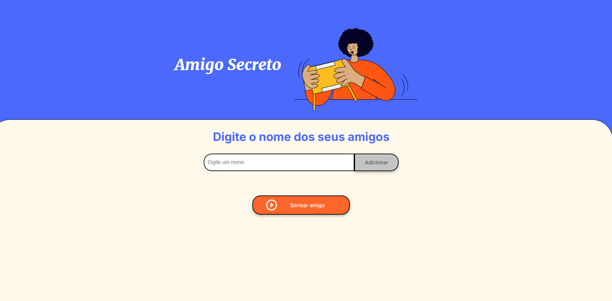

# PROJETO CHALLENGE AMIGO SECRETO ALURA-ONE
## O OBJETIVO DESTE PROJETO:
###  DESENVOLVER UM APP DE SORTEIO DE AMIGO SECRETO

#### INSTRUÇÕES DE USO:
- O USUÁRIO IRÁ ACESSAR O APP
- DIGITAR O NOME DA PESSOA A SER SORTEADA
- CLICAR EM ADICIONAR
- O USUÁRIO IRÁ REPETIR A AÇÃO ATÉ QUE ADICIONE TODOS OS AMIGOS
- POR FIM IRÁ CLICAR EM SORTEAR AMIGO
- O APP IRÁ EXIBIR NA TELA O NOME DO AMIGO SECRETO

#### LINK DO PROJETO:

https://brucecampos.github.io/challenge-amigo-secreto_pt-main/
